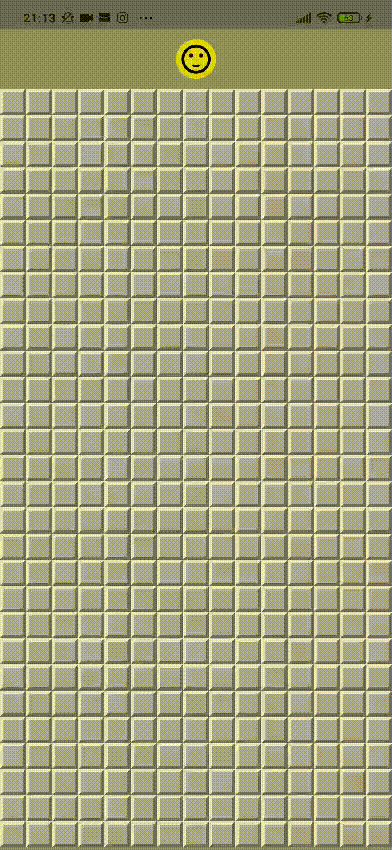

# Campo Minado - Flutter

Oitavo projeto finalizado no curso "Aprenda Flutter e Desenvolva Apps Para Android e IOS 2022".

Neste app mais simples (mas, com uma lógica interessante de recursividade), o usuário consegue jogar o clássico "Campo minado". Há três ações disponíveis para o usuário fazer no jogo: clicar em algum quadrado para revelar, manter o clique para marcar a bomba e reiniciar o jogo clicando no icone colorido em cima.

Versão do Flutter: 3.10.2

